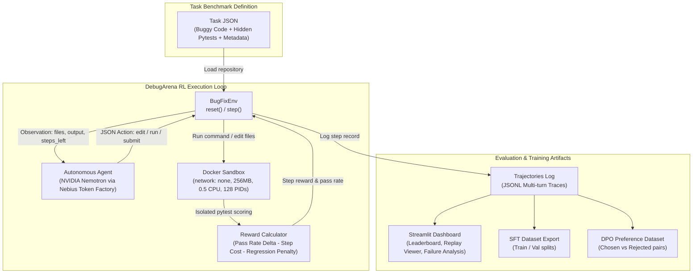

# DebugArena

> **DebugArena — an arena where coding agents compete on real bugs, scored by hidden tests in a Docker sandbox, and every attempt becomes training data.**  
> *Formerly named AgentGym; the Python package keeps the name `agentgym` for compatibility.*  
> *Built for Nebius × NVIDIA Global AI Hackathon · Track: Agent Gym & Coding Environments*

[](https://www.python.org/downloads/)
[](https://opensource.org/licenses/MIT)
[](https://www.docker.com/)
[](https://build.nvidia.com)
[](https://nebius.ai)

---

## 1. Overview

**DebugArena** provides a Gymnasium-style reinforcement learning environment for coding agents. An agent receives a broken Python repository, interacts exclusively by outputting JSON actions (`edit`, `run`, `submit`), executes inside an isolated Docker sandbox, is scored by hidden pytest tests, and exports every verified trajectory directly into SFT and DPO preference datasets.

---

## 2. Architecture



### Execution Loop & Sandbox Isolation
1. **Reset:** `obs = env.reset(task_id)` creates an ephemeral workspace in the Docker container, writes repository files, and executes hidden tests to establish baseline pass rates.
2. **Action Execution:** The agent emits a single JSON action (`edit`, `run`, `submit`). Commands execute in the container with `--network none`, `256MB RAM`, `0.5 CPU`, `128 PIDs`, and a 10s timeout.
3. **Hidden Test Protection:** Hidden tests are mounted read-only at `/tests_hidden` only during environment scoring passes; agent `run` commands cannot see `/tests_hidden` or host files.
4. **Step Reward Formula:**
   $$\text{step\_reward} = (\text{pass\_rate}_t - \text{pass\_rate}_{t-1}) - 0.01 - 0.20 \times \mathbb{I}(\text{regression})$$
   where regression occurs if any previously passing test now fails.
5. **Data Export:** Complete multi-turn trajectories are saved to `runs/<run_id>/trajectories.jsonl`.

---

## 3. Benchmark Tasks (30 Verified Scenarios)

DebugArena includes 30 verified tasks across two suites:
- **Core-20:** 20 fundamental debugging tasks (7 easy, 9 medium, 4 hard) covering off-by-one errors, mutable default arguments, division truncations, custom sorting, and multi-file interfaces.
- **Hard-10:** 10 multi-step engineering bugs (e.g., date arithmetic, interval merging, tokenizer states, transaction rollbacks).

Every task is verified across 3x repetitions with zero flakiness:
```bash
python scripts/verify_tasks.py --suite all --sandbox docker
```

---

## 4. Setup & Quickstart

### Prerequisites
- Python 3.10+
- Docker (Docker Desktop or Linux Docker daemon running)

### Installation
```bash
git clone <REPO_URL>
cd debugarena

python -m venv venv
# Linux / macOS:
source venv/bin/activate
# Windows:
venv\Scripts\activate

pip install -e .
```

### Build Docker Sandbox Image
```bash
docker build -t agentgym-sandbox:python3.11 -f - . <<EOF
FROM python:3.11-slim
RUN pip install --no-cache-dir pytest
WORKDIR /workspace
EOF
```

### Configuration
Copy `.env.example` to `.env` and insert your Nebius API key:
```ini
NEBIUS_API_KEY=your_nebius_api_key
```

---

## 5. How to Run

### 1. Offline Baselines (Quick-Start)
Run the built-in reference solver (upper bound) and no-op submit (lower bound) through the Docker sandbox:
```bash
# Reference Solver:
python scripts/run_eval.py --mock-solver --suite core --run-id baseline_reference_core_v2 --sandbox docker --no-judge
python scripts/run_eval.py --mock-solver --suite hard --run-id baseline_reference_hard_v2 --sandbox docker --no-judge

# No-Op Submit:
python scripts/run_eval.py --noop-solver --suite core --run-id baseline_noop_core_v2 --sandbox docker --no-judge
python scripts/run_eval.py --noop-solver --suite hard --run-id baseline_noop_hard_v2 --sandbox docker --no-judge
```

### 2. Live Model Evaluations
```bash
# Evaluate NVIDIA Nemotron Nano (30B):
python scripts/run_eval.py --model nemotron_nano --suite core --workers 4 --run-id core_nano_v2 --sandbox docker

# Evaluate NVIDIA Nemotron Super (120B):
python scripts/run_eval.py --model nemotron_super --suite core --workers 4 --run-id core_super_v2 --sandbox docker
```

### 3. Launch the Streamlit Dashboard
```bash
streamlit run dashboard/app.py
```

### 4. Export Training Datasets (SFT & DPO)
```bash
# Export Protocol v2 verified SFT dataset (49 episodes)
python scripts/export_dataset.py --protocol v2 --format sft --split

# Export Protocol v2 cross-model DPO dataset (9 preference pairs)
python scripts/export_dataset.py --protocol v2 --format dpo --dpo-mode cross-model --split
```

---

## 6. Empirical Results: Protocol v2 (Main) vs Protocol v1 (Legacy)

### Primary Results: Protocol v2 (Docker Sandbox, Lenient Parser, json_object Mode)

All primary benchmark evaluations are conducted inside isolated Docker containers using Protocol v2.

| Model / Baseline | Suite | Protocol | Sandbox | Solved | Success Rate (%) | 95% Wilson CI | Avg Steps | Avg Return | Avg Judge Score |
|---|---|---|---|---|---|---|---|---|---|
| `nvidia/nemotron-3-super-120b-a12b` | Core-20 | v2 | Docker | 19 / 20 | **95.0%** | `[76.4%, 99.1%]` | 1.10 | +0.762 | 3.95 |
| `nvidia/nemotron-3-super-120b-a12b` | Hard-10 | v2 | Docker | 9 / 10 | **90.0%** | `[59.6%, 98.2%]` | 2.20 | +0.337 | 3.70 |
| `nvidia/NVIDIA-Nemotron-3-Nano-30B-A3B` | Core-20 | v2 | Docker | 18 / 20 | **90.0%** | `[69.9%, 97.2%]` | 1.45 | +0.729 | 3.80 |
| `nvidia/NVIDIA-Nemotron-3-Nano-30B-A3B` | Hard-10 | v2 | Docker | 3 / 10 | **30.0%** | `[10.8%, 60.3%]` | 3.40 | +0.006 | 2.50 |
| `baseline_reference` (Upper Bound) | Core-20 | v2 | Docker | 20 / 20 | **100.0%** | `[83.9%, 100.0%]` | 1.00 | +0.540 | 4.00 |
| `baseline_reference` (Upper Bound) | Hard-10 | v2 | Docker | 10 / 10 | **100.0%** | `[72.2%, 100.0%]` | 1.10 | +0.370 | 3.90 |
| `baseline_noop` (Lower Bound) | Core-20 | v2 | Docker | 0 / 20 | **0.0%** | `[0.0%, 16.1%]` | 1.00 | -0.010 | 0.00 |
| `baseline_noop` (Lower Bound) | Hard-10 | v2 | Docker | 0 / 10 | **0.0%** | `[0.0%, 27.8%]` | 1.00 | -0.010 | 0.00 |

### Legacy Results: Protocol v1 (Local Sandbox, Strict Regex Parser)

Shown separately for reproducibility and harness comparison.

| Model | Suite | Protocol | Sandbox | Solved | Success Rate (%) | 95% Wilson CI | Avg Steps | Avg Return |
|---|---|---|---|---|---|---|---|---|
| `nvidia/nemotron-3-nano-30b-a3b` | Core-20 | v1 | Local | 18 / 20 | **90.0%** | `[69.9%, 97.2%]` | 1.45 | +0.67 |
| `nvidia/nemotron-3-nano-30b-a3b` | Hard-10 | v1 | Local | 9 / 10 | **90.0%** | `[59.6%, 98.2%]` | 1.30 | +0.35 |
| `nvidia/nemotron-3-super-120b-a12b` | Core-20 | v1 | Local | 19 / 20 | **95.0%** | `[76.4%, 99.1%]` | 1.15 | +0.76 |
| `nvidia/nemotron-3-super-120b-a12b` | Hard-10 | v1 | Local | 6 / 10 | **60.0%** | `[31.3%, 83.2%]` | 4.90 | -0.05 |

### Analysis & Harness Sensitivity:
- **Model Comparison & Uncertainty:** With single rollouts per model per suite on small suites (20 core, 10 hard tasks), confidence intervals are wide. Because the model ordering on Hard-10 differed between protocols (Nano led in v1, Super led in v2), the Super-vs-Nano gap on Hard-10 is suggestive, not conclusive.
- **Nano Behavioral Diagnostics on Hard-10 (v2):** In v2, Nano submitted partial fixes without being able to verify all edge cases (5 tasks at 60–80% pass rate), hit the 10-step limit on 1 task (h04), and introduced 1 regression (h05). Because the sandbox, parser, response_format, max_tokens, steps_left header, and prompt wording all changed between v1 and v2, the cause of the change cannot be attributed to a single factor.
- **Harness Sensitivity:** Rankings are sensitive to the harness and environment configuration and should not be read as definitive capability differences.

---

## 7. Dataset Exports & Provenance

- **`debugarena_sft.jsonl` (Primary SFT):** 49 unique verified episodes from Protocol v2 in Docker, split strictly by task (39 train across 24 tasks / 10 val across 5 tasks). Excludes baselines, smoke runs, and mock solvers.
- **`debugarena_dpo_cross_model.jsonl` (Cross-Model DPO Preferences):** 9 preference pairs (chosen from Super-120B, rejected from Nano-30B on identical tasks under Protocol v2 in Docker; 0 same-model pairs), partitioned by task (8 train / 1 val).
- **`debugarena_sft_v1_local.jsonl` (Protocol v1 Archive):** 48 unique verified episodes from legacy Protocol v1 in LocalSandbox kept separate.

---

## 8. Limitations

1. **Benchmark Suite Size:** With $N=30$ total tasks ($N=20$ core, $N=10$ hard), binomial confidence intervals are broad.
2. **Single Evaluation Runs:** Results represent single-run rollouts per configuration.
3. **Language Scope:** Focused on Python 3 repositories.
4. **RL Training Loop:** DebugArena produces SFT and DPO training data; policy training (PPO/GRPO) is performed using the exported datasets.

---

## 9. Products & Technologies Used

- **[Nebius Token Factory](https://nebius.ai):** High-throughput, low-latency LLM API inference compute powering agent rollouts.
- **[NVIDIA Nemotron Models](https://build.nvidia.com):** State-of-the-art open reasoning and coding models (`nvidia/nemotron-3-super-120b-a12b`, `nvidia/nemotron-3-nano-30b-a3b`, `nvidia/nemotron-3-ultra-550b-a55b`).
- **[Docker](https://www.docker.com):** Mandatory isolated container sandbox with zero network access and strict CPU/RAM/PID resource limits.
- **[Streamlit](https://streamlit.io):** Interactive benchmark leaderboard and trajectory replay UI.

---

## 10. License

Distributed under the MIT License. See [LICENSE](LICENSE) for details.
