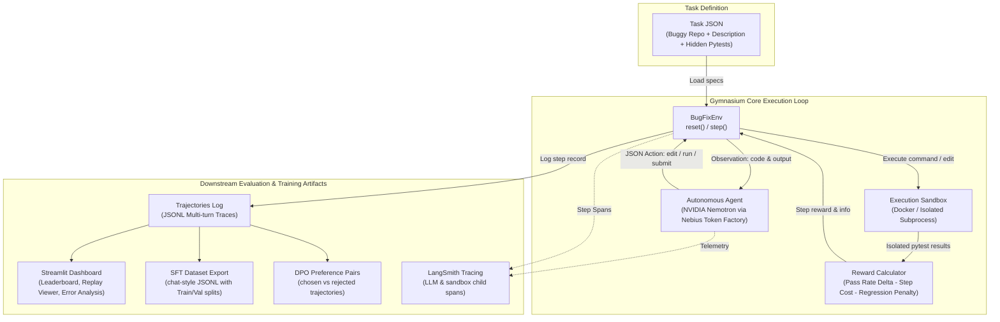

# AgentGym 🏋️

> **An open RL environment where coding agents get better.**  
> *Built for Nebius × NVIDIA Global AI Hackathon · Track: Coding & Agentic Engineering*

[](https://www.python.org/downloads/)
[](https://opensource.org/licenses/MIT)
[](https://www.docker.com/)
[](https://build.nvidia.com)
[](https://nebius.ai)
[](https://smith.langchain.com)

---

## 1. One-Line Pitch

**AgentGym** gives an AI agent a broken Python repo, lets it edit and run code inside an isolated sandbox, scores it automatically with hidden pytest tests, and saves every step as a training-ready dataset—so the environment doesn't just test agents, **it produces the data to improve them**.

---

## 2. Why AgentGym?

Everyone is building coding agents. Very few people are building the place where agents are measured and improved.

- **The Problem:** Frontier labs train agents with internal reinforcement learning environments, but open, lightweight, reproducible environments are virtually non-existent. Existing coding benchmarks (like SWE-bench or HumanEval) provide a binary pass/fail score, but fail to produce clean, multi-turn trajectories formatted directly for Supervised Fine-Tuning (SFT) or Reinforcement Learning (PPO / GRPO).
- **The Solution:** A lightweight, reproducible Gymnasium-style environment powered by **NVIDIA Nemotron** models and **Nebius Token Factory** infrastructure that:
  1. Compares open agent models fairly on bug-fixing benchmarks.
  2. Penalizes regressions and inefficiency directly in the reward function.
  3. Exports verified successful episodes into ready-to-train SFT and DPO preference datasets.
  4. Provides end-to-end observability via LangSmith tracing and expert review packages.

---

## 3. Architecture Overview



### Core Execution Loop
1. **Reset:** `obs = env.reset(task_id)` creates a fresh isolated sandbox container/workspace, populates the repository files, and executes hidden tests to establish an initial baseline pass rate.
2. **Act:** The agent outputs a single validated JSON action:
   - `{"type": "edit", "path": "filename.py", "content": "..."}`
   - `{"type": "run", "cmd": "..."}`
   - `{"type": "submit"}`
3. **Sandbox Isolation:** Commands run with network disabled, CPU/memory limits, and strict timeouts. **Hidden tests are never mounted or visible during agent exploratory runs.**
4. **Reward & Scoring:** Hidden pytest suites run in a separate clean evaluation pass.
   $$\text{step\_reward} = (\text{pass\_rate}_t - \text{pass\_rate}_{t-1}) - 0.01 - 0.20 \times \text{regression}$$
   where $\text{regression} = 1$ if any previously passing test now fails.
5. **Logging & SFT/DPO Export:** Trajectories with full prompts, tool calls, latencies, and Nemotron judge ratings are logged to JSONL and exportable into SFT datasets and DPO preference pairs.

---

## 4. Benchmark Tasks (20 Verified Scenarios)

AgentGym features 20 carefully curated programming and debugging tasks across three difficulty tiers:

| Tier | Count | Examples & Bug Types |
|---|---|---|
| **Easy** | 7 | Off-by-one (`range` inclusive bounds), wrong comparison operator, wrong return value, variable name typos, string reversal, clamp inverted bounds, percentage discount formula. |
| **Medium** | 9 | Empty list zero-division edge case, mutable default argument leakage, wrong string slicing, integer vs float division truncation, dictionary key handling, deep list flattening, moving average index offset, rectangular matrix transpose, LRU cache eviction ordering. |
| **Hard** | 4 | Multi-file interface mismatch (`data_loader.py` + `pipeline.py`), stateful quote tokenizer with escaped characters, custom priority sorting with tie-breaking, resilient retry decorator with attempt counters. |

> **Verification Guarantee:** Every task has at least one baseline test passing before the fix (to evaluate regression penalties), fails at least one test initially, and passes 100% of tests under the reference fix. Every task is verified with 3x repetition to guarantee zero test flakiness.

---

## 5. Sandbox Isolation & Self-Test

AgentGym enforces strict containment whether running in Docker or local subprocess mode:
- **Docker Sandbox:** Runs with `--network none`, `--memory 256m`, `--cpus 0.5`, `--pids-limit 128`, and a 10s execution timeout.
- **Hidden Test Protection:** Hidden tests are injected temporarily only during the internal environment test evaluation pass, and immediately unlinked before control returns to the agent.
- **Automated Sandbox Self-Test:** Run `pytest tests/test_sandbox.py` to verify that:
  1. Hidden test files are completely invisible to agent exploratory `run` commands (attempts to inspect directory or open test files return `FileNotFoundError`).
  2. Infinite loops and runaway processes are killed on timeout.
  3. Commands execute in isolated directories with zero persistent side effects.

```bash
pytest tests/test_sandbox.py -v
```

---

## 6. Quickstart

### Prerequisites
- Python 3.11+
- Optional: Docker Desktop (if running, Docker containers are used automatically; otherwise AgentGym seamlessly uses its isolated local subprocess sandbox).

### Installation
```bash
git clone https://github.com/your-username/agentgym.git
cd agentgym

python -m venv venv
# Linux / macOS:
source venv/bin/activate
# Windows:
venv\Scripts\activate

pip install -e .
```

### Configuration
Copy `.env.example` to `.env` and fill in your API keys:
```bash
cp .env.example .env
```

```ini
NEBIUS_API_KEY=your_nebius_token_factory_key
NVIDIA_API_KEY=your_nvidia_api_key  # Optional fallback
OPENROUTER_API_KEY=your_openrouter_key  # Optional fallback

# Optional LangSmith Tracing
LANGSMITH_API_KEY=your_langsmith_api_key
LANGSMITH_PROJECT=agentgym
LANGSMITH_TRACING=true
```

---

## 7. How to Run

### 1. Zero-Flakiness Verification
```bash
python scripts/verify_tasks.py
```
Validates all 20 tasks 3 times sequentially to ensure test determinism.

### 2. Run Evaluations
Run evaluation batches across tasks with multithreaded workers and automatic resumability:

```bash
# Evaluate NVIDIA Nemotron Super:
python scripts/run_eval.py --model nemotron_super --tasks all --workers 4 --run-id run1_nemotron_super

# Evaluate NVIDIA Nemotron Nano:
python scripts/run_eval.py --model nemotron_nano --tasks all --workers 4 --run-id run1_nemotron_nano

# Run Offline Reference Solver (Upper Bound):
python scripts/run_eval.py --mock-solver --tasks all --workers 4 --run-id baseline_mock_solver

# Run Offline No-op Submit Baseline (Lower Bound):
python scripts/run_eval.py --noop-solver --tasks all --workers 4 --run-id baseline_noop_submit --no-judge
```

### 3. Launch the Streamlit Dashboard
```bash
streamlit run dashboard/app.py
```
Open [http://localhost:8501](http://localhost:8501) to explore:
- **🏆 Leaderboard:** Real model standings with success rates, average returns, step efficiency, and mean ± spread aggregation.
- **📊 Task Breakdown & Error Analysis:** Model × Task matrix, success rates by difficulty & bug type, and failure category distribution (Invalid JSON, Regression, Ran out of steps, Wrong fix).
- **🎬 Episode Replay:** Step-by-step interactive debugger viewing agent conversation histories, actions, diffs, outputs, and reward deltas.

### 4. Export Training Datasets (SFT & DPO)
```bash
# Export SFT dataset with 80/20 train/val split and deduplication:
python scripts/export_dataset.py --format sft --split

# Export DPO preference dataset (chosen vs rejected pairs):
python scripts/export_dataset.py --format dpo --split
```

---

## 8. Observability & Human Review

### LangSmith Tracing
AgentGym supports first-class observability through LangSmith. Enable tracing via CLI or `config.yaml`:

```bash
python scripts/run_eval.py --model nemotron_nano --tasks t01_off_by_one --trace --run-id trace_demo
```

- **Trace Hierarchy:** The root run encapsulates the entire episode, with child spans for each LLM reasoning turn and environment execution step.
- **Privacy & Integrity:** Hidden test contents and solutions are strictly excluded from traces.
- **Offline Fallback:** If `LANGSMITH_API_KEY` is not present, tracing gracefully falls back to local logging without interrupting evaluation.
- **Viewing Traces:** Inspect execution trees at `https://smith.langchain.com/o/<org>/projects/p/<project-id>?peek=<run-id>`.

### Human Expert Review Pack (Tendem / Toloka)
To evaluate the idiomatic quality, correctness, and safety of agent-generated code with human experts:
1. Generate the review pack:
   ```bash
   python scripts/make_review_pack.py
   ```
   Outputs `review_pack/review_pack.md` containing problem descriptions, original buggy code, unified fix diffs, and 5 structured review questions.
2. Ingest reviewed results:
   ```bash
   python scripts/import_review.py --reviews review_pack/reviews.json
   ```
   Filters solutions with expert rating $\ge 4$ into `dataset/agentgym_sft_human_verified.jsonl`.

---

## 9. Real Empirical Results & Leaderboard

All evaluations below reflect **real empirical execution** across the full 20-task benchmark:

| Model / Baseline | Pass Rate (%) | Solved Tasks | Avg Steps | Avg Return | Avg Judge Quality (1-5) |
|---|---|---|---|---|---|
| **`nvidia/nemotron-3-super-120b-a12b`** | **95.0%** | **19 / 20** | 1.20 | **+0.53** | 3.85 / 5.0 |
| **`nvidia/nemotron-3-nano-30b-a3b`** | **90.0%** | **18 / 20** | 1.25 | **+0.40** | 3.80 / 5.0 |
| **Reference solver (upper bound)** | **100.0%** | **20 / 20** | 2.00 | **+0.53** | 4.00 / 5.0 |
| **No-op submit (lower bound)** | **0.0%** | **0 / 20** | 1.00 | **-0.01** | N/A |

### Key Empirical Findings:
- **Nemotron Super (120B)** achieves a **95% pass rate**, solving 19 out of 20 tasks on its initial attempt with zero regressions.
- **Nemotron Nano (30B)** delivers high efficiency (**90% pass rate**), but encountered a regression on `t16_lru_cache_eviction`, which the reward function penalized appropriately (-1.09 return).
- In both models, our strict JSON output validation and alias normalization achieved a **0% invalid-JSON failure rate**.

---

## 10. Limitations & Scope (MVP)

- **Language Scope:** Focused exclusively on Python 3 repositories. Multi-language support (TypeScript, Rust, Go) is slated for v0.2.
- **Task Scope:** Tasks target self-contained algorithms and modules (1–3 files, <60 lines) to enable rapid iteration, fast feedback loops, and inexpensive RL rollouts rather than multi-thousand-line monorepos.
- **Data Export Focus:** The environment focuses on trajectory collection and SFT/DPO export; in-process RL policy updates (GRPO/PPO training loop) are conducted externally using the exported datasets.

---

## 11. Built With

- **[Nebius Token Factory](https://nebius.ai):** High-throughput, low-latency OpenAI-compatible API compute powering agent inference and evaluation.
- **[NVIDIA Nemotron Models](https://build.nvidia.com):** State-of-the-art open reasoning and coding models (`nvidia/nemotron-3-super-120b-a12b`, `nvidia/nemotron-3-nano-30b-a3b`, `nvidia/nemotron-3-ultra-550b-a55b`).
- **[LangSmith](https://smith.langchain.com):** Multi-span hierarchical observability tracking agent reasoning, environment transitions, and latency.
<!-- TODO: Bhaskar to confirm Tendem/Toloka review completion before final submission -->
- **[Tendem / Toloka]:** Expert human-in-the-loop code verification and annotation workflow.
- **[Streamlit](https://streamlit.io):** Interactive web dashboard for benchmark comparison, failure mode inspection, and episode replaying.
- **[Docker & Python Subprocess]:** Secure, constrained sandboxes with resource, PID, and network limits.

*(Note: Nebius Serverless Jobs was evaluated as an optional batch runner architecture in the design phase but is not utilized in the local/Docker MVP execution harness).*

---

## 12. License

Distributed under the MIT License. See [LICENSE](LICENSE) for more information.
